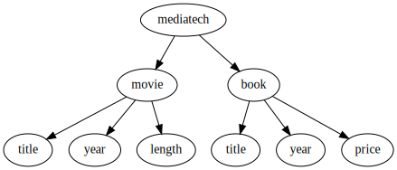
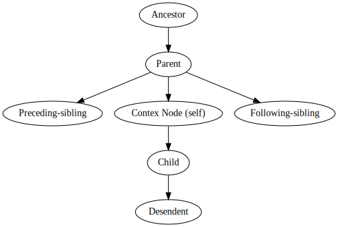

- [XML Introduction](#xml-introduction)
- [1. XML Document](#1-xml-document)
  * [Markup and Content](#markup-and-content)
  * [Tag](#tag)
  * [Element](#element)
  * [Attribute](#attribute)
  * [XML Elements vs. Attributes](#xml-elements-vs-attributes)
  * [XML Prefix and Namespaces](#xml-prefix-and-namespaces)
  * [XML Syntax Rules](#xml-syntax-rules)
  * [Characters and Encoding](#characters-and-encoding)
  * [CDATA](#cdata)
  * [XML Parser](#xml-parser)
  * [Programming Interfaces](#programming-interfaces)
    + [Document Object Model  (DOM)](#document-object-model---dom-)
    + [Simple API for XML](#simple-api-for-xml)
    + [XML Data Binding](#xml-data-binding)
    + [Declarative Transformation](#declarative-transformation)
- [2. XML Validation](#2-xml-validation)
  * [XML Document Type Definition](#xml-document-type-definition)
  * [XML XSD](#xml-xsd)
    + [XSD Data Types](#xsd-data-types)
      - [String](#string)
      - [Date, Time, DateTime, Duration Data Type](#date--time--datetime--duration-data-type)
        * [Date](#date)
        * [Time](#time)
        * [DateTime](#datetime)
        * [Duration](#duration)
      - [Numeric Data](#numeric-data)
        * [Decimal](#decimal)
        * [Integer](#integer)
      - [XSD Simple Elements](#xsd-simple-elements)
        * [Default and Fixed Values for Elements](#default-and-fixed-values-for-elements)
      - [XSD Attributes](#xsd-attributes)
        * [Default and Fixed Values for Attributes](#default-and-fixed-values-for-attributes)
        * [Optional and Required Attributes](#optional-and-required-attributes)
      - [XSD Complex Element](#xsd-complex-element)
        * [1. Empty Elements](#1-empty-elements)
        * [2. Elements Containing Only Other Elements.](#2-elements-containing-only-other-elements)
        * [3. Elements Containing Only Text](#3-elements-containing-only-text)
        * [<simple/complexType> and <simple/complexContent>](#-simple-complextype--and--simple-complexcontent-)
        * [4. Elements Containing Other Elements and Text.](#4-elements-containing-other-elements-and-text)
      - [XSD Schema](#xsd-schema)
- [3. XML Databases](#3-xml-databases)
  * [XPath](#xpath)
    + [XPath Expressions](#xpath-expressions)
    + [XPath Functions](#xpath-functions)
    + [XPath Operators](#xpath-operators)
    + [XPath Axes](#xpath-axes)
  * [XQuery](#xquery)
- [4. XSLT](#4-xslt)
- [5. API Example and Open source Libraries](#5-api-example-and-open-source-libraries)
  * [XML Parser](#xml-parser-1)
    + [Xerces](#xerces)
    + [Onsgmls](#onsgmls)
    + [XML4C](#xml4c)
  * [Transformation Engines](#transformation-engines)
    + [Xalan](#xalan)

# XML Introduction
XML, you hear this word a lot, even if you are not a software developer. XML is almost all over the internet and has made a big impact on it since its introduction in 1998. XML stands for eXtensible Markup Language, and it was created to be a language for transferring, storing, and transforming data which can be easily read and interpreted by both humans and machines.
This is an example of an XML document, it seems pretty simple, just information about a book wrapped in tags, yet it is very powerful and flexible as we will see in the rest of this video's series. 
```
<?xml version="1.0" encoding="UTF-8"?>
<book>
	<title lang="fr">UML Distilled</title>
	<ISBN>789654 </ISBN>
	<author>Martin Fowler </author>
	<author>Kendall Scott </author>
</book>
```
XML is extensible, that means you can add the followings:

```
<?xml version="1.0" encoding="UTF-8"?>
<book>
	<title lang="fr">UML Distilled</title>
	<ISBN>789654 </ISBN>
	<author>Martin Fowler </author>
	<author>Kendall Scott </author>
	<price>19.0</price>
</book>
```

XML has a variety of uses. For instance, in web publishing, `XMLHttpRequest` transfers data between a web browser and a web server and can retrieve data from a URL without having to do a full page refresh. This enables a Web page to update just part of a page without disrupting what the user is doing.

Those web services, that you are using on daily basis on your phone, RSS news feed, your Spotify playlist, SVG files that you use for creating vector graphic design, these are just a few examples of XML applications. The list is long, but I guess that's enough for the introduction.


If you get excited by this intro, and it caught your attention, and you are looking for somewhere to start learning XML, then you are in the right place.
Follow this playlist, and you will learn everything you need to know about XML. 

So what would be covered in this course:

1) In the first chapter, we will have look at XML Terminology. We also introduce XML Syntax Rules, so we can create a well-formed XML document. 
Then we talk about programming language Interfaces for XML  such as `SAX` and `DOM`, so you can process an XML document in your favorite programming language.


2) In the second chapter, we introduce XML Validation and two main tools for validating an XML document. Validation means an XML document is not only well-formed, but it has elements and structure that you want. These two tools are `DTD` and `XSD` (Schema Definition)

3) In the third chapter, we introduce XML Databases, and we will see how can we use `XPath` and `XQuery` to store and retrieve the data from an XML document


4) In the chapter four, we introduce `XSLT` (XML EXtensible Stylesheet Language Transformations) which is a language for transforming XML documents into other XML documents/ formats such as HTML, plain text.

5) Finally in the last chapter, we introduce free and open source libraries and tools for parsing, validating, rendering, and basically what we have learned in the previous chapters 
 with programming languages, C/C++ my choice of course, but you use can any programming language from XML application development

# 1. XML Document

## Markup and Content
A markup language is a computer language that defines elements within a document using tags. Markup files contain standard words,
rather than typical programming syntax. When the document is rendered for display, the markup language doesn't appear. 

XML (despite its name) is not a markup language. It's a set of rules for building markup languages.
In XML, strings that constitute markup begin with the character `<` and end with a `>`.
Strings of characters that are not markup are content.

Refs: [1](https://techterms.com/definition/markup_language#:~:text=A%20markup%20language%20is%20a,rather%20than%20typical%20programming%20syntax.&text=XML%20is%20called%20the%20%22Extensible,a%20wide%20range%20of%20elements.)
[2](http://sedataglossary.shoutwiki.com/wiki/Markup_language)


## Tag
A tag is a markup construct that begins with `<` and ends with `>`. There are three types of tag:
1. start-tag, such as `<start-tag>`;
2. end-tag, such as `</end-tag>`;
3. empty-element tag, such as` <empty-element />`.

## Element
XML elements are basic building block of the XML document. An XML element is everything from (including) the element's start tag to (including) the element's end tag. 

An element can contain:
1. Text,for instance:
```
    <title>The Matrix Resurrections</title>
    <director>Lana Wachowski</director>
    <year>2021 </year>
    <length>2h 28m</length>
```

The `<title>, <director>,  <length>` and ` <year>`,  have text content.

2. Other elements, For instance:

```
<movie>
    <title>The Matrix Resurrections</title>
</movie>    
```

3. Attributes, For instance:
```
  <book category="IT" />
```

4. A mixture of the above (including none of them).

```
<mediatech>
  <movie category="sci-fi">
    <title>The Matrix Resurrections</title>
    <director>Lana Wachowski</director>
    <year>2021 </year>
    <length>2h 28m</length>
  </movie>
</mediatech>
```

or consists only of an empty-element tag:
```
  <movie category="sci-fi" />
```

## Attribute
An attribute is a markup construct consisting of a name-value pair that exists within a tag:

`<movie category="sci-fi">`

Attributes can **not** contain tree structures and they are not easily expandable (for future changes).
Attribute values must always be quoted either single or double quotes.
Some attribute names have been reserved for special purposes. These attributes begin with the prefix xml: 
`xml:lang,xml:space, xml:link, xml:attribute`


## XML Elements vs. Attributes
There are no rules about when to use attributes or when to use elements in XML, however if a certain entity is **PART** of the data, then it is recommended to make it an element. For instance the name of the movie is an essential part of the movie data.
If it provides additional information about the data and it is not actually part of the data (**METADATA**), it is better to make it an attribute. For example, category of a movie is additional information about a movie.

Elements form:
```
<movie>
	<category>sci-fi<category>
	<title>The Matrix Resurrections</title>
	<director>Lana Wachowski</director>
	<year>2021 </year>
	<length>2h 28m</length>
</movie>
```

Attribute form:
```
<movie category="sci-fi">
	<title>The Matrix Resurrections</title>
	<director>Lana Wachowski</director>
	<year>2021 </year>
	<length>2h 28m</length>
</movie>
```

Also putting things in attributes makes for less verbose XML. For instance compare the following with the above one:
```
<movie title="The Matrix Resurrections" director="Lana Wachowski" year="2021"/>
```


## XML Prefix and Namespaces
suppose you have the followings XML fragments:

```
<library>
    <name>OpenCV</name>
    <language>C++</language>
</library>
```
and 

```
<library>
    <name>City Media-tech Library</name>
    <type>public</type>
</library>
```

If these were added together, there would be a name conflict and a user or an XML parser will not be able to handle these differences. This problem can be solved by using a prefix.


```
<root>
<s:library>
    <s:name>OpenCV</s:name>
    <s:language>C++</s:language>
</s:library>

<p:library>
    <p:name>City Media-tech Library</p:name>
    <p:type>public</p:type>
</p:library>
</root>
```
If you use prefixes in XML, a namespace for the prefix must be defined. The namespace can be defined by an `xmlns` attribute in the start tag of an element with the following syntax. `xmlns:prefix="URI"`. An URI (Uniform Resource Identifier) is a string of characters which identifies an Internet Resource. URL is the most common URI which identifies an Internet domain address. 

```
<root>

<s:library xmlns:s="http://exmple.com/software-libraries/">
    <s:name>OpenCV</s:name>
    <s:language>C++</s:language>
</s:library>

<p:library xmlns:p="http://exmple.com/physical-libraries" >
    <p:name>City Media-tech Library</p:name>
    <p:type>public</p:type>
</p:library>

</root>
```
The namespace URI is **not** used by the parser to look up information. The use of a URI serves to give the namespace a unique name. Companies, frequently employ the namespace as a link to a web page containing namespace information. 


## XML Syntax Rules
- XML is case sensitive.
- XML document must have a root element.
- All tags must have a closing.
- Elements must be nested properly.
- Attribute values must always be quoted.

```
<root>
  <child>
    <subchild>.....</subchild>
  </child>
</root>
```


**Well Formed**: XML document that conforms to the syntax rules above.


## Characters and Encoding
Almost every legal Unicode character may appear in an XML document, i.e. 
`ø,æ,å,ê,è,é`

or for instance the following element:

```
<冰淇淋 フレーバー="ռուսերեն">данные</冰淇淋>
```
Escaping characters begin with the character `&` and end with a `;`

- `&lt;` represents "<";
- `&gt;` represents ">";
- `&amp;` represents "&";
- `&apos;` represents "'";
- `&quot;` represents '"'.

White spaces are preserved in XML.

The following is called **Prolog**, it is optional, but if it exists, it must come as the first line in the document:

`<?xml version = "version_number" encoding = "encoding_declaration" standalone = "standalone_status" ?>`

- Version:	`1.0,  1.1`
- Encoding:	`UTF-8, UTF-16, ISO-10646-UCS-2, ISO-10646-UCS-4, ISO-8859-1 to ISO-8859-9, ISO-2022-JP, Shift_JIS, EUC-JP`
- Standalone:		`yes` or `no`


## CDATA 
Stands for Character Data and has the following form:
```cpp
<![CDATA[  your-string  ]]>
```
and it means that the data in between `<![CDATA[` and `]]>` could be interpreted as XML markup, but should not be. 
Any character data (other than `]]>`) can appear within the section without needing to be escaped. i.e. angle brackets `<>` and ampersands `&`.

For instance imagine you have a tutorial page in which you have lots of special characters (i.e. `&` and `<`) but those characters aren't meant to be xml.
Instead of writing it like this:
```
<example-code>
while (x &lt; len &amp;&amp; !done) {
    print( &quot;Still working, &apos;zzz&apos;.&quot; );
    ++x;
    }
</example-code>
```
 you can write it as:
 
```cpp
<example-code><![CDATA[
while (x < len && !done) {
    print( "Still working, 'zzzz'." );
    ++x;
    }
]]></example-code>
```

The key differences between CDATA and comments is CDATA is **still part of the document, while a comment is not**.


## XML Parser

XML parser is a tool that reads XML documents and turns the stream of characters into an internal representation. 
`TinyXML, Saxon, Xerces, MSXML` are example XML parser. We will restive them in the following chapters.

## Programming Interfaces
According to the XML design goals: "It shall be easy to create programs that can process XML documents". However there is essentially no detail in the XML specification on how programmers might go about performing such processing.

Existing XML processing APIs will fall into the following categories.

### Document Object Model  (DOM)
Every XML document has a tree structure, the root element is at the top, and the child elements are related to the root elements through branches, similar to how leaves are connected to trees through branches. It is very easy to traverse all succeeding branches and leaf nodes, starting from the root with Tree-traversal APIs from a programming language.

Document Object Model (DOM) is an API that enables you to navigate a document like a tree of node objects.


```
<mediatech>
  <movie category="sci-fi">
    <title>The Matrix Resurrections</title>
    <director>Lana Wachowski</director>
    <year>2021 </year>
    <length>2h 28m</length>
  </movie>
  <book category="IT">
    <title>UML distilled</title>
    <author>Martin Fowler</author>
    <year>1997</year>
    <price>39.95</price>
  </book>
</mediatech>
```
We can create

```  
object{1}  
└──mediatech{2}  
	├──movie {5}
	│	├── title : The Matrix Resurrections
	│	├── director : Lana Wachowski
	│	├── year : 2021
	│	├── length : 2h 28m
	│	└──_category : sci-fi
	│
	└──book {5}
		├── title : UML distilled
		├── author : Martin Fowler
		├── year : 1997
		├── price : 69.420
		└──_category : IT
   
```    
<!-- dot -Tsvg mediatech.dot > mediatech.svg -->




  
Tree-traversal and data-binding APIs typically require the use of much more memory, but are often found more convenient for use by programmers

### Simple API for XML

SAX (Simple API for XML): Is a stream-based processor. You only have a tiny part in memory at any time and you "sniff" the XML stream by implementing callback code for events like tagStarted() etc. It uses almost no memory, but you can't do "DOM" stuff, like use xpath or  tree traversing.

Refs: [1](https://stackoverflow.com/questions/6828703/what-is-the-difference-between-sax-and-dom)

### XML Data Binding
 XML data binding  provides an automated translation between an XML document and programming-language objects.


### Declarative Transformation 
Example of declarative transformation are `XSLT` and `XQuery`.

# 2. XML Validation

A well-formed document follows the basic syntactic rules of XML, but most of the time it is not enough for any appliction development, and it should follow a defined structure. For instance, the elements and attributes that can appear in a document, their order and data type, child elements, default and fixed values, etc.
DTD and  XML schema are two main tools for validating a XML document. DTD is an old solution, and you should use XML schema instead, but for the sake of completeness, We will have a brief look on DTD.

## XML Document Type Definition
DTD defines what elements are required and what attributes can be set. An XML DTD can be either specified inside the document, or outside.

Example of internal DTD

```
<?xml version="1.0" encoding="utf-8" standalone="yes"?>

<!DOCTYPE address
[
    <!ELEMENT address (name,company,phone)>
    <!ELEMENT name (#PCDATA)>
    <!ELEMENT company (#PCDATA)>
    <!ELEMENT phone (#PCDATA)>
]
>
<address>
    <name>customer name</name>
    <company>co ltd</company>
    <phone>123456</phone>
</address>
```

Example of external DTD
```
<?xml version = "1.0" encoding = "UTF-8" standalone = "no" ?>
<!DOCTYPE address SYSTEM "address.dtd">
<address>
   <name>Tanmay Patil</name>
   <company>TutorialsPoint</company>
   <phone>(011) 123-4567</phone>
</address>
```

The file `address.dtd` contains:
```
<!ELEMENT address (name,company,phone)>
<!ELEMENT name (#PCDATA)>
<!ELEMENT company (#PCDATA)>
<!ELEMENT phone (#PCDATA)>

```
PCDATA means parse-able text data.

## XML XSD
XML XSD (Schema Definition) is also used to describe and validate the structure and the content of XML data.
XSD dictates what elements and attributes should appear in a document, number and order of them, data types and also default and fixed values for them. 
The main difference between DTDs and XML Schema is that XML Schema uses an XML-based syntax, whereas DTDs use a unique syntax that dates back to SGML DTDs, so to use the DTD, you should learn a new grammar.


### XSD Data Types

The following is the list of most common XSD data types
#### String 
```
<xs:element name="elementName" type="xs:string"/>
```
to trim spaces, line feeds, carriage returns, tabs use `xs:token`
```
<xs:element name="elementName" type="xs:token"/>
```
[List of all XSD string types](https://www.w3schools.com/xml/schema_dtypes_string.asp)

#### Date, Time, DateTime, Duration Data Type
All field are mandatory.

##### Date
```
<xs:element name="startDate" type="xs:date"/>
<startDate>YYYY-MM-DD</startDate>
```

##### Time

```
<xs:element name="startTime" type="xs:time"/>
<startTime>hh:mm:ss</startTime>

```

##### DateTime

```
<xs:element name="startDateTime" type="xs:dateTime"/>
<startDateTime>YYYY-MM-DDThh:mm:ss</startDateTime>
```
##### Duration

```
<xs:element name="period" type="xs:duration"/>
<period>P2Y4M7DT1H</period>
```

Period of 2 years, 4 months, 7 days, and 1 hours.

[List of all XSD  date time data types](https://www.w3schools.com/xml/schema_dtypes_date.asp)


#### Numeric Data
##### Decimal
```
<xs:element name="size" type="xs:decimal"/>
<size>69.420</size>
```
##### Integer
```
<xs:element name="id" type="xs:integer"/>
<id>10</id>
```


[List of all XSD numeric types](https://www.w3schools.com/xml/schema_dtypes_numeric.asp)


[List of all built in primitive datatypes](https://www.w3.org/TR/xmlschema11-2/#built-in-primitive-datatypes)


#### XSD Simple Elements
An XML element that just hold text is a simple element. There can't be any additional elements or attributes in it.

Here are some simple XML elements:

```
<title>On the Origin of Species</title>
<ISBN>987123 </ISBN>
<author>Charles Darwin</author>
<price>42.0</price>
```

The corresponding simple element definitions:

```
<xs:element name="title" type="xs:string" />
<xs:element name="ISBN" type="xs:integer" />
<xs:element name="author" type="xs:string"/>
<xs:element name="price" type="xs:decimal" />
```
An other example:

```
<size>L</size>
```

```
<xs:element name="size">
	<xs:simpleType>
			<xs:restriction base="xs:string" >
				<xs:enumeration value="S" />
				<xs:enumeration value="M" />
				<xs:enumeration value="L" />
			</xs:restriction>
	</xs:simpleType>
</xs:element>
```


##### Default and Fixed Values for Elements
When no additional value is specified for an element, it is given a default value.
```
<xs:element name="year" type="xs:date" default="2020-01-01"/>
```

A fixed value is also automatically assigned to the element, and you cannot specify another value.

```
<xs:element name="year" type="xs:date" fixed="2020-01-01"/>
```


#### XSD Attributes

The syntax for defining an attribute is:

```
<xs:attribute name = "attributeName" type = "xxxxxx"/>
```
Here is an XML element with an attribute:

```
<title lang="en">The lord of the ring</title>
```
The corresponding attributes definitions:
```
<xs:attribute name="lang" type="xs:string"/>
```

##### Default and Fixed Values for Attributes
Just like elements, when no additional value is specified, it is given a default value.
```
<xs:attribute name="lang" type="xs:string" default="EN"/>
<xs:attribute name="lang" type="xs:string" fixed="EN"/>
```
##### Optional and Required Attributes
By default, attributes are optional. Use the "use" to indicate that the attribute is required:
```
<xs:attribute name="lang" type="xs:string" use="required"/>
```


#### XSD Complex Element
An XML element that contains other elements and/or attributes is known as a complicated type element.

There are four kinds of complex elements:

##### 1. Empty Elements
```
<product id="458184"/>
```
Whenever you write XSD element,you can write it specifically for that particular element, or you can give it a name  and reuse it again. It is analogs to writing `define type` in C++.

```
  <xs:element name="product">
    <xs:complexType>
       <xs:attribute name="id" type="xs:integer" />
    </xs:complexType>
  </xs:element>
```

Here with `name="productType"` can be used for other elements:

```
<xs:complexType name="productType">
  <xs:attribute name="id" type="xs:integer" />
</xs:complexType>


<xs:element name="product" type="productType" />
```


##### 2. Elements Containing Only Other Elements.
```
<book>
<ISBN> 123654</ISBN>
<author>J. R. R. Tolkien</author>
<price>69.69</price>
</book>
```

```
<xs:element name="book">
<xs:complexType>
	<xs:sequence>
		<xs:element  name="ISBN" type="xs:integer" />
		<xs:element  name="author" type="xs:string" />
		<xs:element  name="price" type="xs:decimal" />				
	</xs:sequence>
</xs:complexType>
</xs:element>
```

or with a name for the bookType: `name="bookType"`:

```
<xs:complexType name="bookType">
	<xs:sequence>
		<xs:element  name="ISBN" type="xs:integer" />
		<xs:element  name="author" type="xs:string" />
		<xs:element  name="price" type="xs:decimal" />				
	</xs:sequence>
</xs:complexType>

<xs:element name="book" type="bookType" />
```

You can use `extend` to extend a type. it is analogs to inheritance in OOP:

```
<EUAddress>
    <streetName>some street name in EU</streetName>
    <HouseNumber>12</HouseNumber>
    <Country>somerset</Country>
    <Postcode>781459</Postcode>
</EUAddress>
<USAddress>
    <streetName>some street name in USA</streetName>
    <HouseNumber>78</HouseNumber>
    <State>state name</State>
    <Zipcode>841511</Zipcode>
</USAddress>
```


```
<xs:complexType name="BaseAddressType">
    <xs:sequence>
        <xs:element name="streetName" type="xs:string" />
        <xs:element name="HouseNumber" type="xs:integer" />
    </xs:sequence>
</xs:complexType>
<xs:complexType name="EUAddressType">
    <xs:complexContent>
        <xs:extension base="BaseAddressType">
            <xs:sequence>
                <xs:element name="Country" type="xs:string" />
                <xs:element name="Postcode" type="xs:integer" />
            </xs:sequence>
        </xs:extension>
    </xs:complexContent>
</xs:complexType>
<xs:complexType name="USAddressType">
    <xs:complexContent>
        <xs:extension base="BaseAddressType">
            <xs:sequence>
                <xs:element name="State" type="xs:string" />
                <xs:element name="Zipcode" type="xs:string" />
            </xs:sequence>
        </xs:extension>
    </xs:complexContent>
</xs:complexType>
```


##### 3. Elements Containing Only Text
Text-Only elements contains text and attributes, therefore we add a `<simpleContent>` element around the content. 
When using `<simpleContent>`, you must define an `<extension>` OR a `<restriction>` within the `<simpleContent>` element.
You can define `restriction` to limit the text:

```
<drink cat="warm">L</drink>
```

```
    <xs:simpleType name="enumStringType">
        <xs:restriction base="xs:string">
            <xs:enumeration value="S"></xs:enumeration>
            <xs:enumeration value="M"></xs:enumeration>
            <xs:enumeration value="L"></xs:enumeration>
        </xs:restriction>
    </xs:simpleType>

    <xs:complexType name="drinkType" mixed="true">
        <xs:simpleContent>
            <xs:extension base="enumStringType">
                <xs:attribute name="cat" type="xs:string">
                </xs:attribute>
            </xs:extension>
        </xs:simpleContent>
    </xs:complexType>
    
    <xs:element name="drink" type="drinkType"/>
```

##### <simple/complexType> and <simple/complexContent>

- `<complexType>` and `<simpleType>` both define types.  
- `<complexType>` can have element and attributes while `<simpleType>` can't.  
- `<complexType>` can have `<simpleContent>`  or `<complexContent>`. 
- `<simpleContent>` can only contain characters.  
- when using `<simpleContent>`, you must define an `<extension>` OR a `<restriction>` within the `<simpleContent>` element.


##### 4. Elements Containing Other Elements and Text.
```
<event>
occurred on <date>01.01.2020</date> in <location> Springfield  </location>
</event>
```
To enable character data to appear between the child-elements of "event", the mixed attribute must be set to "true".

```
<xs:complexType name="eventType" mixed="true">
  <xs:sequence>
    <xs:element name="shipdate" type="xs:date"/>
    <xs:element name="name" type="xs:string"/>
  </xs:sequence>
</xs:complexType>


<xs:element name="event" type="eventType"/>
```

#### XSD Schema
The `<schema>` element is the root element of every XML Schema:

```
<?xml version="1.0"?>
<xs:schema attributeFormDefault="unqualified" elementFormDefault="qualified" xmlns:xs="http://www.w3.org/2001/XMLSchema">

.
.
.
</xs:schema>
```

Referencing a Schema in an XML Document: 

```
<?xml version="1.0"?>

<movie xmlns:xsi="http://www.w3.org/2001/XMLSchema-instance" xsi:schemaLocation="https://www.example.com/movie.xsd">
    <title>The Matrix Resurrections</title>
    <director>Lana Wachowski</director>
    <year>2021-10-01 </year>
    <length>2h 28m</length>
</movie>
```


Refs: [1](https://stackoverflow.com/questions/1544200/what-is-difference-between-xml-schema-and-dtd)  
[Online XSD Validator/ Generator](https://www.freeformatter.com/xsd-generator.html#ad-output)

# 3. XML Databases
Information in the XML format could be stored in an XML database. 
<!--
There are two major types of XML databases:

1) XML- enabled
2) Native XML (NXD)


 -->
 
The following is an example of an XML database:


```
<?xml version="1.0" encoding="UTF-8" ?>
<?xml-stylesheet type="text/xsl" href="book.xsl" ?>
<shop>
	<!-- Comment: This is a list of books -->
	<book>
		<title lang="en">The lord of the ring</title>
		<ISBN> 123654</ISBN>
		<author>J. R. R. Tolkien</author>
		<price>69.69</price>
	</book>
	<book>
		<title>On the Origin of Species</title>
		<ISBN>987123 </ISBN>
		<author>Charles Darwin</author>
		<price>42.0</price>
	</book>
	<book>
		<title lang="fr">UML Distilled</title>
		<ISBN>789654 </ISBN>
		<author>Martin Fowler </author>
		<author>Kendall Scott </author>
		<price>19.0</price>
	</book>
</shop>	
```
## XPath

XPath (XML Path Language) is a query language  based on the tree representation of the XML document, for selecting nodes and computing values (numbers, strings, Boolean ) . XPath is made of a path with the syntax similar to directory structures in Unix-like operating systems, `/, //, ., .., etc.` to select nodes or node-sets in an XML document. You can navigate in XML documents by using Xpath. 

<!-- In XPath, there are seven kinds of nodes: element, attribute, text, namespace, processing-instruction, comment, and document nodes.
-->

### XPath Expressions

All books from root:
```
/
```

```
    
The lord of the ring
 123654
J. R. R. Tolkien
69.69


On the Origin of Species
987123 
Charles Darwin
42.0


UML Distilled
789654 
Martin Fowler 
Kendall Scott 
19.0
```

Selects all titles in the document from the root (nothing will be retuned):
```
/title
```

Selects all titles in the document from the current node, no matter where they are (`//` means any descendant node of the current node):
```
//title
```
```
The lord of the ring
On the Origin of Species
UML Distilled
```
			

Which is equal to:
```
/shop/book/title
```

Select the parent of title which is book
```
/shop/book/title/..
```

```
The lord of the ring
 123654
J. R. R. Tolkien
69.69


On the Origin of Species
987123 
Charles Darwin
42.0


UML Distilled
789654 
Martin Fowler 
Kendall Scott 
19.0
```


Title of the first book:
```
/shop/book[1]/title
```


All books that have a language attribute:
```
/shop/book/title[@lang]
```
All book with french language: 
```
//title[@lang='fr']
```
All languages:
```
//@lang
```
or
```
/shop/book/title/@*
```


### XPath Functions
Last title:

```
/shop/book/title[last()]
```

Count numbers of all books:
```
count(/shop/book)
```

[List of XPath Functions](https://developer.mozilla.org/en-US/docs/Web/XPath/Functions)


### XPath Operators
You can use operations on the Xpath. 

The price of the book with the title `On the Origin of Species`:
```
/shop/book[title='On the Origin of Species']/price
```


Title of all book with the price over 40.0:
```
/shop/book[price>40.0]/title
```
All titles with prices:

```
/shop/book/title | /shop/book/price
```
[List of XPath Operators](https://www.javatpoint.com/xpath-operators)

### XPath Axes
In Xpath you use location path to define location of a node using absolute or relative path. You can also use **axes** to identify elements by their relationship like
**parent**, **child**, **siblings**, **ancestors** (a node's parent, parent's parent,...), **descendants** (node's children, children's children,...)



```
/shop/book/preceding-sibling::comment()
```

```
/shop/book/following-sibling::node()
```
```
/shop/book[3]/preceding-sibling::node()
```

```
/shop/book[1]/following-sibling::node()
```
```
/descendant::price
```

```
/shop/child::book
```


[List of XPath Axes](https://www.w3schools.com/xml/xpath_axes.asp)  
[Online Xpath and XQuery Tester](https://www.videlibri.de/cgi-bin/xidelcgi)

Refs: [1](https://www.softwaretestinghelp.com/xpath-axes-tutorial/)


## XQuery
The data in the XML database can be queried, and exported in a variety of formats using **XQuery**. XQuery is to XML is like SQL is to databases. 
XQuery is similar to SQL query. You can use **FLWOR Expressions** for writing queries.

- For - selects a sequence of nodes
- Let - binds a sequence to a variable
- Where - filters the nodes
- Order by - sorts the nodes
- Return - what to return (gets evaluated once for every node)


consider the following XPath:
```
/shop/book[title='On the Origin of Species']/price
```
This can be expressed with XQuery as followings:

```
for $x in /shop/book
where $x/title='On the Origin of Species'
return $x/price
```

# 4. XSLT 
XSLT (EXtensible Stylesheet Language Transformations) is a language for transforming XML documents into other XML documents/ formats such as HTML, plain text or XSL Formatting Objects, which may subsequently be converted to other formats, such as PDF, PostScript and PNG.
XSLT utilized XPath to find information in an XML document.
`<xsl:stylesheet>` or `<xsl:transform>` is the root element that declares the document to be an XSL style sheet. Either can be used (they are completely synonymous and can be used interchangeably). 

```
<xsl:stylesheet version="1.0" xmlns:xsl="http://www.w3.org/1999/XSL/Transform">
```
or 
```
<xsl:transform version="1.0" xmlns:xsl="http://www.w3.org/1999/XSL/Transform">
```
Since we are interested to process the entire XML database document, we set the match attribute of the template tag into "/".
For our XML file from previous example

```
<?xml version="1.0"?>
<xsl:stylesheet version="1.0" xmlns:xsl="http://www.w3.org/1999/XSL/Transform">
<xsl:template match="/">
<html>
<body>
<table>
<tr>
	<td>title</td>
	<td>author</td>
	<td>ISBN</td>
</tr>
<xsl:for-each select="shop/book">
<tr>
  	<td> <xsl:value-of select="title"/> </td>
	<td> <xsl:value-of select="author"/> </td>
	<td> <xsl:value-of select="ISBN"/> </td>
</tr>
</xsl:for-each>
</table>
</body>
</html>
</xsl:template>
</xsl:stylesheet>
```
The transformed XML is:

```
<html>
   <body>
      <table>
         <tr>
            <td>title</td>
            <td>author</td>
            <td>ISBN</td>
         </tr>
         <tr>
            <td>The lord of the ring</td>
            <td>J. R. R. Tolkien</td>
            <td> 123654</td>
         </tr>
         <tr>
            <td>On the Origin of Species</td>
            <td>Charles Darwin</td>
            <td>987123 </td>
         </tr>
         <tr>
            <td>UML Distilled</td>
            <td>Martin Fowler </td>
            <td>789654 </td>
         </tr>
      </table>
   </body>
</html>
```

[Online XSL Transformer](https://www.freeformatter.com/xsl-transformer.html#ad-output) 


# 5. API Example and Open source Libraries 
On Ubuntu, run the following command to set up  tools that we need:
`sudo apt install libtinyxml-dev libxslt1-dev  libxml2-dev libxerces-c-dev libxqilla-dev  libxalan-c-dev sudo apt install xqilla opensp`

## XML Parser


### Xerces

### Onsgmls


### XML4C

## Transformation Engines

### Xalan


 TOC generated [here](https://ecotrust-canada.github.io/markdown-toc/)

